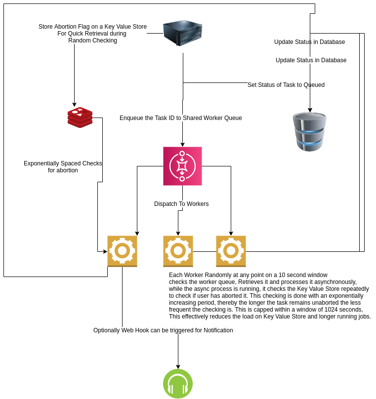

# A Scheduler for Distributed Jobs with Abortion Support 

## Running the System in Docker
```
git clone https://github.com/siddharths067/AtlanScheduler.git
cd AtlanScheduler/
docker-compose build && docker-compose up
``` 
to execute it

By default for the sake of solving the question and easy evaluation from your end, I launch 3 workers


# API Routes and POSTMAN collection for testing

```GET /{userId}``` Gets the tasks of user as JSON

```POST /```  Submits a task by the user

```DELETE / ``` deletes a task by the user

See The Data Model and POSTMAN collection for details on how to send requests

Here is the button for postman collection for testing. 

[](https://app.getpostman.com/run-collection/8c4704b570e6d850a929)


# Data Modelling
The Task Datatype is as follows
```$xslt
id: id of the task
uid: id of the user
status: status of the task queued/running/aborted/termination/succesful
task: identifier of the task to be used by worker object to identify handler
data: optional JSON data to pass to handler in worker
hook: webhook to trigger optionally in handler in worker
```

Each task name has a corresponding handler in worker identified by ```FunctionMapper Object```

# Overview of the System Design


* The user submit a task using the POST request
* A task entry is created and the id is enqueued in the Global Shared Queue
* The Workers check the queue using a random scheme on a 10 second window
* Worker retrieves an id from Queue and updates the database entry to ```running```
* The workers invoke corresponding handler with data attribute passed to the them
* The handler processes the data
* While handler processes the data an exponentially increasing window strategy is used
to check if user has aborted the task by checking a flag in the key value store
* If the user has aborted, the worker terminates the handler thread and updates DB entry
* Else task is successfully completed and DB is updated

# Scaling
* The System is expected to scale horizontally by increasing the worker containers. For the purpose
of easy evaluation I have just added the worker project in the same repo, however it is trivial
to see that it could be used in a separate docker image to extend the system horizontally
